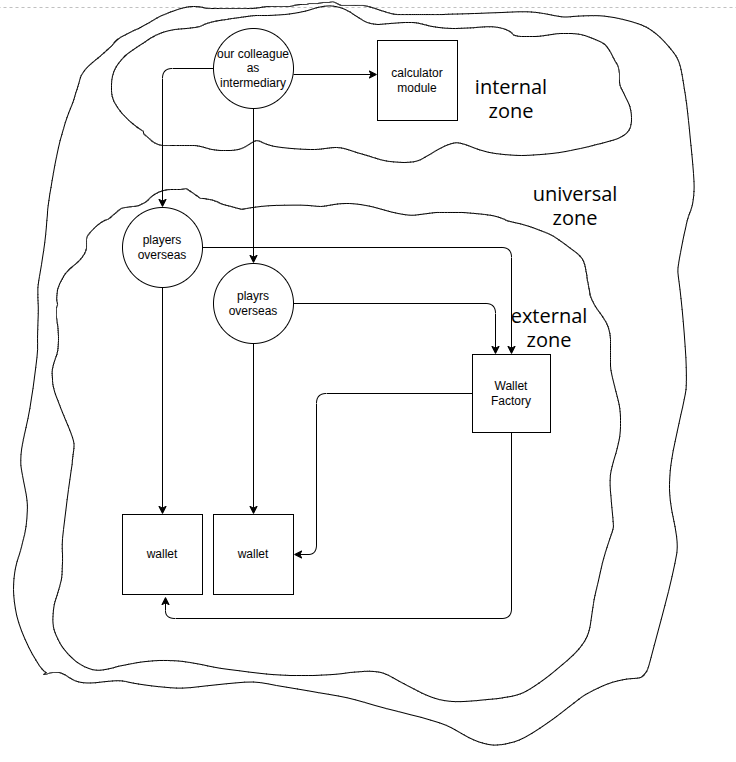

## Breaking the connection to protect our digital assets on public blockchains in front of banning

### The transaction flow
Despite the decentralized philosophy of public blockchain, in several layers of this economic environment various entities observe transactions. If tracking the IP address lead the observer to some specific region, they may ban the account address and although addresses which did business with it. 
When a transaction is created, it is signed by client secret key, and then is sent to a public RPC provider or a full node, which can be although a miner or not, anyway the transaction will be validated and if pass will be propagated to other peers. Then it will live on these nodes memory pool, till some miner take it, mine it, include it in a block and propagate it. There are analyst nodes in the network who try to find and take action in front of transactions initiated from some specific region, the public RPC provider may try to track the transaction and although every node may take action.

### Common practices
To mitigate the risk of banning, there are some approaches which is recommended and following them depends on our already implemented infrastructure and how fundamental are we ready to refactor. After signing the transaction, instead of sending to one RPC provider or a full node, we can acquire several cloud servers and make them responsible for sending to nodes, we may want to change these servers periodically, and have several full nodes of our own, following the same pattern. I thought that maybe we should categorize transactions and put the ones which have to be executed sequentially in one part. 

Crypto companies do not treat all their assets the same, they store values in several layers in various methods and they may use Hard Secure Devices to manage part of their assets but is not the risk of getting banned always there if we rely completely on the network?

### Making a well distributed combinations of digital assets which we have control on them while those are disconnected from us
Suppose estimated value of our clients assets in our custody is 10 million but we need only 2 million of it to handle our daily requests and the rest rest in rarely touched. Suppose to mitigate the risk we want to put the 7 million of the remaining, some where safe, but we although want to keep the ratio steady meaning if our market cap increased to 20 million we want our support to worth 14 and if decreased to 5 the support value decrease to 3.5. Suppose we do proper risk calculations and the mentioned percentages are pretty accurate and the even if we loose access to all 2 or 3 million at which was at risk, the growth we had can cover the loss, and we are insuring our customer by our own calculation and there is no surprise if we lose all 2 or 3 million. Now how can we achieve this? 
My idea is relatively simple whether it is practical or not.
Let's put it in simple terms.



#### Assumptions
- Tracking is done based on IP addresses and if a smart contract is deployed from a clean region, and ones communicating with it are from clean region, there is no risk of being reported.
- We do not consider the possibility of malicious actions to disrupt some smart contract reputation.

#### Smart contracts
##### Wallet 
- these smart contracts can be funded with cypto or tokens but only the one who present our specific message with our signature can withdraw based on the message we signed

##### Factory
- this smart contract will be responsible for creating and deploying wallets

#### Players
##### Individual overseas willing to accept or give up none digital assets like fiat money or gold and charge or withdraw (with our provided singed message) from wallet
##### Our direct colleague who communicate with calculating module and then with individuals overseas to keep the ratio as it should be

#### Capital evaluation and ratio calculation module
- this module will use the data provided in our core services and although data about prices and prepare reports about proper ratio

#### The flow
- Our colleague will communicate with our calculating module to see what combination is proper now, then it will communicate with players overseas and ask them to create wallet using factory and fund, or provide them signed messages so they could withdraw from them. We suppose the process of transferring none digital assets can be managed. 


#### When is this reasonable
what we discussed required to transfer a big proportion of our capital overseas, in a restricted environment, it does not seem reasonable. maybe it is true but note that we only do this once, and then the value we are transferring is limited.


#### Prerequisites
- Node.js: ^22.17.0 
- npm: Version ^10.9.2

#### Cloning, nstallation & Testing

```bash
git clone https://github.com/moeinmir/protecting-digital-assets-from-blockchain-bans-by-getting-disconnected.git 
cd ./protecting-digital-assets-from-blockchain-bans-by-getting-disconnected/src
npm install
npx hardhat test
```

```bash
Running node:test tests

  WalletFactory + Wallet
    ✔ Should deploy WalletFactory and create signed message for wallet creation
    ✔ Should create wallet with correct signature
    ✔ Should fail to create wallet with wrong signature
    ✔ Should transfer ETH with correct signature
    ✔ Should fail ETH transfer with incorrect signature


  5 passing (2176ms)

```
#### Wallet contract
```solidity
// SPDX-License-Identifier: MIT
pragma solidity ^0.8.0;

import "@openzeppelin/contracts/token/ERC20/IERC20.sol";
import "@openzeppelin/contracts/utils/cryptography/ECDSA.sol";

contract Wallet {
    using ECDSA for bytes32;
    address private owner;

    constructor(address _owner) {
        require(_owner != address(0), "Invalid owner address");
        owner = _owner;
    }
    
    receive() external payable {}
    
    fallback() external payable {}
    
    function provideSignatureWithdrawFund(
        address to,
        uint256 amount,
        bytes memory signature,
        address tokenAddress
    ) external {
        require(to != address(0), "Invalid recipient address");
        require(amount > 0, "Amount must be greater than 0");
        bytes32 messageHash = getMessageHash(to, amount, tokenAddress);
        bytes32 ethSignedMessageHash = keccak256(
            abi.encodePacked("\x19Ethereum Signed Message:\n32", messageHash)
        );
        address signer = ECDSA.recover(ethSignedMessageHash, signature);
        require(signer == owner, "Invalid signature");
        
        if (tokenAddress == address(0)) {
            require(address(this).balance >= amount, "Insufficient ETH balance");
            payable(to).transfer(amount);
        } else {
            IERC20 token = IERC20(tokenAddress);
            require(token.balanceOf(address(this)) >= amount, "Insufficient token balance");
            require(token.transfer(to, amount), "Token transfer failed");
        }
    }
    
    function getMessageHash(
        address to,
        uint256 amount,
        address tokenAddress
    ) public view returns (bytes32) {
        return keccak256(abi.encodePacked(
            to,
            amount,
            tokenAddress,
            address(this), 
            block.chainid
        ));
    }
    
    function getOwner() public view returns (address) {
        return owner;
    }
}
```

#### WalletFactory contract
```solidity
// SPDX-License-Identifier: MIT
pragma solidity ^0.8.0;

import "@openzeppelin/contracts/utils/cryptography/ECDSA.sol";
import "./Wallet.sol";

contract WalletFactory {
    address private signer;

    constructor(address _signer) {
        require(_signer != address(0), "Invalid signer address");
        signer = _signer;
    }
    
    function createWallet(
        address owner,
        bytes memory signature,
        bytes32 salt
    ) external returns (address walletAddress) {
        require(owner != address(0), "Invalid owner address");
        bytes32 messageHash = getCreateWalletMessageHashWithSalt(owner, salt);
        bytes32 ethSignedMessageHash = keccak256(
            abi.encodePacked("\x19Ethereum Signed Message:\n32", messageHash)
        );
        address recoveredSigner = ECDSA.recover(ethSignedMessageHash, signature);
        require(recoveredSigner == signer, "Invalid signature for wallet creation");
        walletAddress = address(new Wallet{salt: salt}(owner));
        return walletAddress;
    }
    
    function getCreateWalletMessageHashWithSalt(
        address owner,
        bytes32 salt
    ) public view returns (bytes32) {
        return keccak256(abi.encodePacked(
            owner,
            salt,
            address(this),
            block.chainid
        ));
    }
    
    function getSigner() public view returns (address) {
        return signer;
    }
}
```